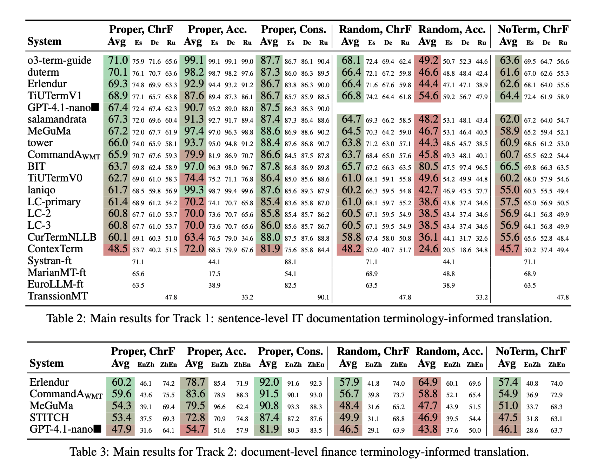

# WMT25 Terminology Shared Task

This repository accompanies the WMT25 Terminology Shared Task.

## License
All materials in this repository are licensed under the CC BY-NC 4.0 [license](LICENSE.md).

## Data

- the submitted system outputs are to be found in [ranking/submissions](ranking/submissions) folder
- the reference translations are to be found in [ranking/references](ranking/references) folder

## Evaluation

_This chapter is being updated..._

The table shows results for **three modes of terminology**: `Proper`, `Random` and `NoTerm` for proper, random terms or no terms at all.

We used three metrics to rank the systems:

1. **General MT Quality**: measured with ChrF (to be consistent with both sentence- and document-level translation, since the neural metrics are not working well on long documents). Represented by the columns `ChrF`.
2. **Terminology Success Rate** measures the percentage of the proper term translations in the system outputs. Represented by `Acc` columns. **NB:** In all three modes, the measured terms are the proper terms, i.e. the output of the `random` mode or `noterm` mode is still compared against the proper terms.
3. **Term consistency**: measures how consistent the translations of the terms are, irrespective of whether they are correct. Represented by `Cons.` columns. **NB:** Analogously to success rate, the terms for all three modes are proper terms.

You can see two tables with main statistics:

 - **Table 6** shows the results of the Track1 (sentence-level MT). For systems that provided all three translation directions, it shows an average score of them (scores for each direction are shown in small numbers, target languages are denoted, source language is `En` in all cases).
 - **Table 7** shows the results of the Track2 (document-level MT). The results are averaged scores of 5 texts for each translation direction. 

## Plotting results

- To generate LaTeX code for the tables, run `python3 visualization/plot_table_track1.py; python3 visualization/plot_table_track2.py`
- To generate tradeoff figures, run `python3 visualization/plot_tradeoff.py`
- To generate the effect of terminology mode, run `python3 visualization/plot_effect_termmode.py`

